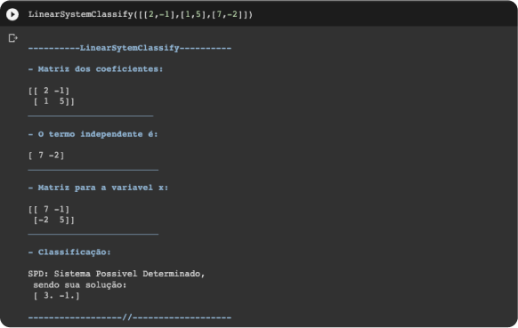
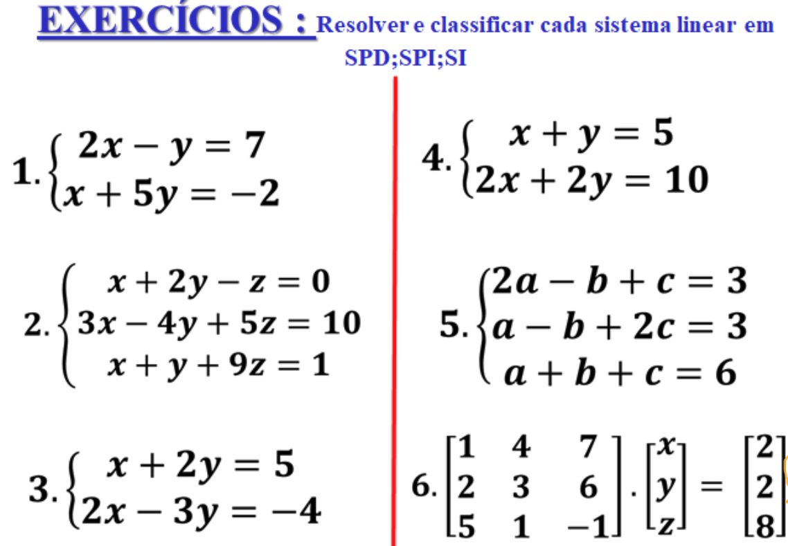

# classifica-sistema-linear
> Atividade da disciplina método numéricos computaciona

Para a resolução dessa atividade criei uma função para a classificação de sistemas lineares, sendo ela chamada de `LinearSystemClassify`:

- **SPD** (*Sistema Possível Determinado*)
- **SPI** (*Sistema Possível e Indeterminado*)
- **SI** (*Sistema Impossível*)

E recebe como parametro um array, contendo os valores dos coeficientes e dos termos indenpedentes e a própria função separa os termos e gera as matrizes respectivas para a classificação. caso o sistema linear for **SPD**, ele irá mostrar a solução do mesmo.

$$
\begin{cases}
2x-y=7 \\
x+5y=-2
\end{cases}
$$

ver mais sobre o [LinearSystemClassify](./Notebooks/LinearSystemClassify.ipynb)

## Exercicio

Ver solução do Exercicio - [Atividade resolvida](./Notebooks/Atividade%20resolvida.ipynb)

## Autor
Vinicius Zapalá dos Santos
- **RA**: 3019109027
